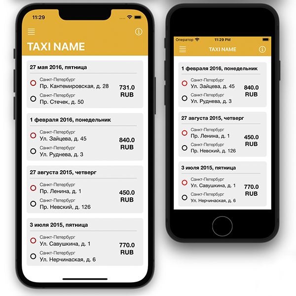
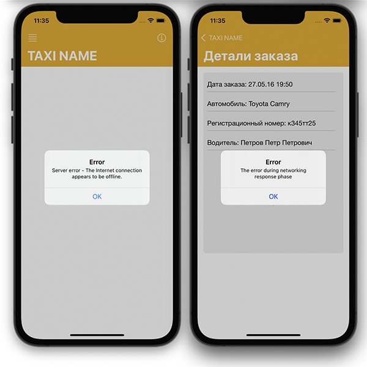
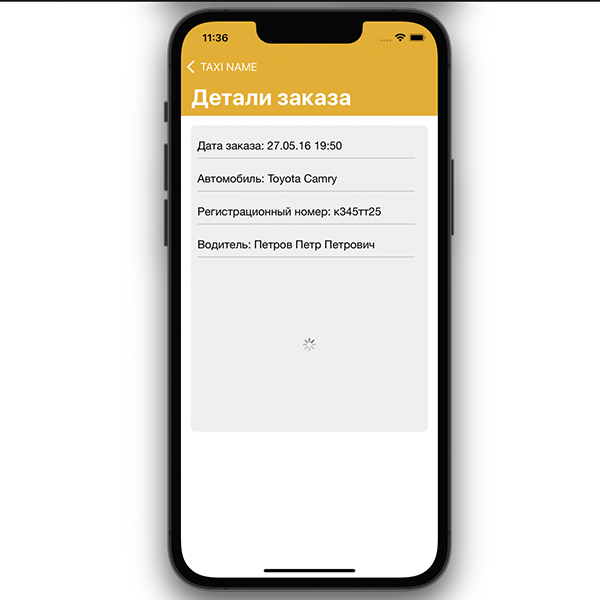

# TaxiTestTask
## Оглавление
- **[Краткое описание](#Basic)**
- **[Презентация](#Presentation)**
- **[Задание](#Task)**
- **[Будет добавлено](#ComingSoon)**

## Краткое описание
- Проект написан на **UIKit**
- Использована архитеутра **VIPER**
- Адаптивная верстка интерфейса **кодом**. Проверна на **iPhoneSE (1st generation)**
- Работа с сетью **URLSession**
- Работа с изображениями **Kingfisher**
- При загрузке изображение кешируется и храниться в памяти в течении 10 минут.
- Добавлена обработка ошибок при работе с NetworkManager, ImageManager. Ошибки отображаются пользователю через UIAlerController.
- Добавлен индикатор загрузки изображения при работе с экраном детальной информации.
## Презентация

## Задание
- Необходимо написать приложение, которое загружает с сервера JSON-файл,
разбирает его и выводит на экран отсортированный по убыванию даты список с информацией об активных заказах в службе такси.
- В каждом элементе списка должны отображаться:
  - Начальный адрес
  - Конечный адрес
  - Дата поездки
  - Стоимость заказа
- По нажатию на элемент списка необходимо показать экран с детализацией,
где, помимо перечисленных выше полей, должны отображаться время заказа, а также информация о машине и водителе.
- При разработке приложения необходимо использовать архитектуру VIPER
- Приложение должно поддерживать iOS 13.0+ и быть оформлено в соответствии с руководством iOS Human Interface Guidelines.
Язык программирования для реализации тестового задания – Swift 5.3+
## Будет добавлено
- Unit testing
